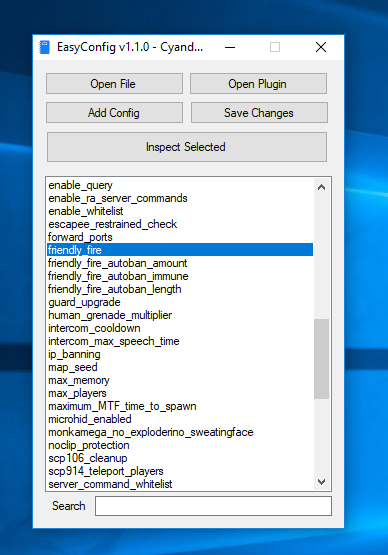
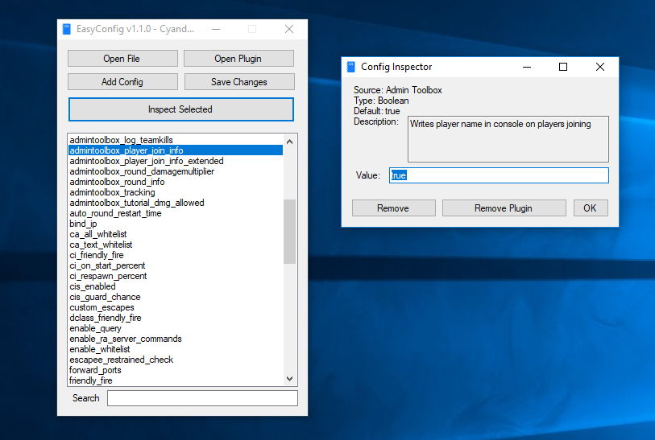

# EasyConfig

GUI interface to make editing SCP:SL server config files easier.

**Only supports editing for gameplay config files.**

# Features
- Alphabetical sorting of configs and searching
- Importing Smod2 Plugin dlls to automatically add all configs within the plugin as well as their descriptions, default values, and value types (currently only supports int, string, boolean, and float types)
- Reopening last edited config and imported plugins on launch
- Adding, removing, and editing configs
- Keyboard shortcuts
  - `Del` - Deletes currently selected config
  - `Shift + Del` - Deletes the plugin the current config is part of
  - `Enter` - Inspects the currently selected config
- Right click context menu to allow easy inspection or removal

# Images

